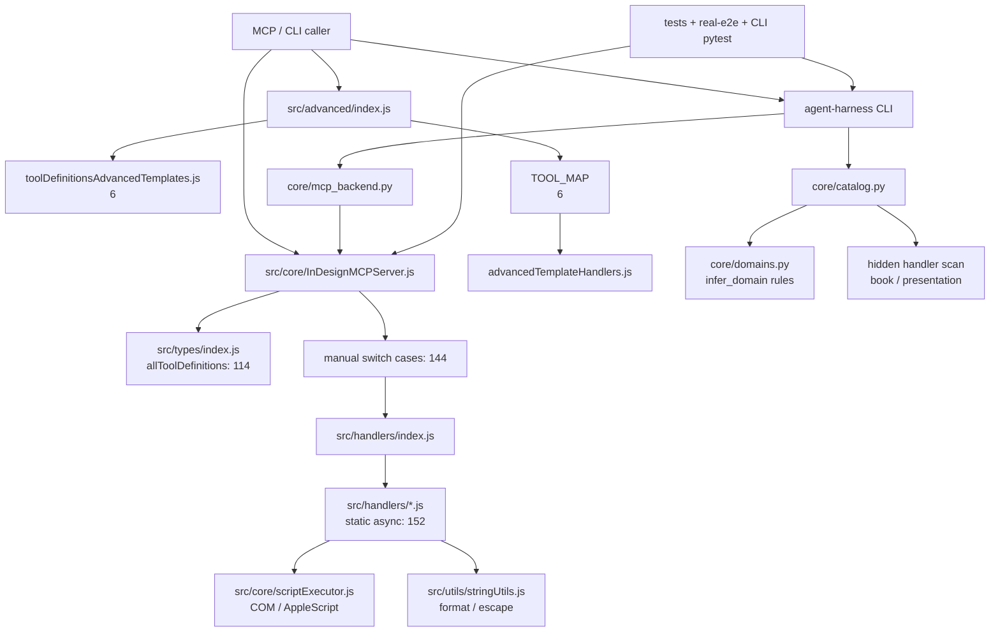

# 结构图与指标

日期：2026-07-04

状态：已生成初版

## 审查基线

工作区：

```text
D:\AI\mcp-indesign
```

Git 状态：

```text
## master...origin/master
 M AGENTS.md
 M docs/README.md
 M docs/superpowers/specs/2026-07-03-indesign-tool-semantics-design.md
?? docs/AI协作/本地Agent/进行中/2026-07-04_架构全面重构审查/
?? docs/superpowers/plans/2026-07-04-indesign-tool-semantics-plan.md
?? docs/superpowers/specs/2026-07-04-indesign-architecture-refactor-design.md
```

当前指标来自只读命令，不包含实现修改。

## 顶层体量

| 范围 | 文件数 | 行数 |
| ---- | ------ | ---- |
| `src/**/*.js` | 36 | 11233 |
| `agent-harness/cli_anything/indesign` production `.py` | 28 | 3907 |
| `agent-harness/cli_anything/indesign/tests` `.py` | 2 | 1637 |
| `tests/real-e2e` `.js/.mjs` | 9 | 2282 |
| `tests/tool-suite` `.js/.mjs` | 1 | 324 |
| `tests` root `.js/.mjs` | 24 | 5658 |

## 工具映射现状

| 指标 | 当前值 | 来源 |
| ---- | ------ | ---- |
| exposed tool definitions | 114 | `node scripts\quick_check.mjs` |
| classic server switch cases | 144 | `src/core/InDesignMCPServer.js` |
| handler `static async` methods | 152 | `src/handlers` |
| advanced template definitions | 6 | `src/types/toolDefinitionsAdvancedTemplates.js` |
| advanced template `TOOL_MAP` entries | 6 | `src/advanced/index.js` |

`allToolDefinitions` 与 classic server switch 对比：

```json
{
  "definitions": 114,
  "cases": 144,
  "extraCases": 30,
  "missingCases": 0
}
```

多出来的 30 个 classic switch case 当前不在 `allToolDefinitions` 中：

```text
preflight_document
data_merge
get_document_xml_structure
export_document_xml
save_document_to_cloud
open_cloud_document
validate_document
cleanup_document
place_xml_on_spread
create_book
open_book
list_books
add_document_to_book
synchronize_book
repaginate_book
update_all_cross_references
update_all_numbers
update_chapter_and_paragraph_numbers
export_book
package_book
preflight_book
print_book
get_book_info
set_book_properties
create_presentation_document
add_cover_page
add_section_page
add_full_bleed_image
add_image_grid
export_presentation_pdf
```

初步结论：当前至少存在三层不同“真相”：

- `src/types/index.js` 决定 MCP exposed tools。
- `src/core/InDesignMCPServer.js` 决定 classic server 可调度 case。
- `agent-harness/cli_anything/indesign/core/catalog.py` 决定 CLI catalog，并额外解析 hidden handler。

这正是 registry 重构要先解决的核心问题。

## Tool definition 分组

| 分组 | 数量 |
| ---- | ---- |
| `pageToolDefinitions` | 19 |
| `contentToolDefinitions` | 22 |
| `documentToolDefinitions` | 23 |
| `exportToolDefinitions` | 4 |
| `presentationToolDefinitions` | 0 |
| `bookToolDefinitions` | 0 |
| `utilityToolDefinitions` | 4 |
| `pageItemGroupToolDefinitions` | 18 |
| `masterSpreadToolDefinitions` | 11 |
| `spreadToolDefinitions` | 10 |
| `layerToolDefinitions` | 3 |

注意：`bookHandlers.js` 和 `presentationHandlers.js` 有 server switch case，但对应 exposed definitions 当前为 0。先按 hidden handler 纳入 source map 保护，再逐项判定 CLI catalog 暴露、测试覆盖和最终保留方式，不能当死代码删除。

## 大 handler 文件

| 文件 | 行数 |
| ---- | ---- |
| `src/handlers/documentHandlers.js` | 1388 |
| `src/handlers/advancedTemplateHandlers.js` | 1008 |
| `src/handlers/pageItemHandlers.js` | 667 |
| `src/handlers/pageHandlers.js` | 635 |
| `src/handlers/graphicsHandlers.js` | 569 |
| `src/handlers/bookHandlers.js` | 432 |
| `src/handlers/styleHandlers.js` | 432 |
| `src/handlers/masterSpreadHandlers.js` | 417 |
| `src/handlers/textHandlers.js` | 402 |
| `src/handlers/groupHandlers.js` | 333 |
| `src/handlers/spreadHandlers.js` | 333 |
| `src/handlers/helpHandlers.js` | 318 |
| `src/handlers/exportHandlers.js` | 204 |
| `src/handlers/presentationHandlers.js` | 198 |
| `src/handlers/utilityHandlers.js` | 77 |
| `src/handlers/layerHandlers.js` | 72 |

`src/handlers` 中 `executeInDesignScript`、`formatResponse`、`formatErrorResponse`、`JSON.parse` 相关匹配约 333 处。handler runtime 的价值在于收口执行和返回包装，不是抽象 JSX 业务逻辑。

## Python CLI 体量

| 文件 | 行数 |
| ---- | ---- |
| `agent-harness/cli_anything/indesign/indesign_cli.py` | 502 |
| `agent-harness/cli_anything/indesign/core/catalog.py` | 490 |
| `agent-harness/cli_anything/indesign/core/hidden_handler_schemas.py` | 327 |
| `agent-harness/cli_anything/indesign/core/router.py` | 274 |
| `agent-harness/cli_anything/indesign/core/plugins/manifest.py` | 259 |
| `agent-harness/cli_anything/indesign/core/mcp_backend.py` | 201 |
| `agent-harness/cli_anything/indesign/core/bootstrapper.py` | 184 |
| `agent-harness/cli_anything/indesign/agent_bootstrapper.py` | 180 |
| `agent-harness/cli_anything/indesign/core/plugins/validate.py` | 169 |
| `agent-harness/cli_anything/indesign/core/domains.py` | 167 |

CLI 推断点：

```text
agent-harness/cli_anything/indesign/core/catalog.py:8 imports infer_domain
agent-harness/cli_anything/indesign/core/catalog.py:170 HIDDEN_HANDLER_FILES
agent-harness/cli_anything/indesign/core/catalog.py:316 domain = infer_domain(name, description)
agent-harness/cli_anything/indesign/core/catalog.py:488 hidden handler file scan
agent-harness/cli_anything/indesign/core/domains.py:26 EXACT_TOOL_DOMAINS
agent-harness/cli_anything/indesign/core/domains.py:37 NAME_DOMAIN_RULES
agent-harness/cli_anything/indesign/core/domains.py:136 KEYWORD_DOMAINS
agent-harness/cli_anything/indesign/core/domains.py:166 infer_domain()
```

打包现状：

```text
MANIFEST.in:
include package.json
include package-lock.json
recursive-include src *
recursive-include skills *
prune agent-harness/cli_anything/indesign/tests

pyproject package-data:
"cli_anything.indesign" = ["skills/*.md", "node/*.mjs"]
```

如果 Node registry artifact 放入 Python package，需要同步 `MANIFEST.in` 和 `pyproject.toml`。

## 测试体量

| 文件 | 行数 |
| ---- | ---- |
| `tests/real-e2e/lib/scenarios.mjs` | 1362 |
| `tests/index.js` | 597 |
| `tests/test-image-assets.js` | 379 |
| `tests/unified-test-runner.js` | 355 |
| `tests/test-standard-document.js` | 354 |
| `tests/tool-suite/run-all-tools.js` | 324 |
| `tests/test-advanced-features.js` | 322 |
| `tests/test-content-management.js` | 315 |
| `tests/test-bounds-checking.js` | 297 |
| `tests/test-document-preferences.js` | 277 |
| `tests/test-pageitem-group.js` | 274 |
| `tests/test-real-image.js` | 263 |
| `tests/test-swatches-and-backgrounds.js` | 251 |
| `tests/test-grid-layout.js` | 237 |
| `tests/test-basic-workflow.js` | 232 |

`tests/real-e2e/lib/scenarios.mjs` 和 Python `test_core.py` 是后续测试拆分的主要对象。

## 当前结构图



## 重构压力点

1. `allToolDefinitions`、server switch、CLI catalog 不是同一个真相源。
2. classic server 有 30 个可调度 case 未 exposed，不能简单删除。
3. advanced server 有独立 tool map，需要决定是否纳入统一 registry 或保留独立 registry 分支。
4. CLI 内置工具 domain / id 依赖 Python 推断，后续语义层不能继续复用这种方式。
5. handler 重复执行/解析包装多，但 JSX 业务逻辑不适合被 runtime 过度抽象。
6. 大测试文件承接太多场景，重构期间需要先补 architecture / registry / router 单元测试，再拆 E2E。
