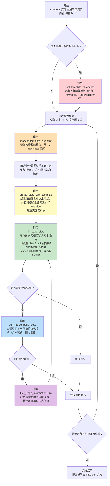

# AI Agent 模板制作流程图

```mermaid
---
id: 9c4bab6c-377d-4730-8e94-c2ede1f73c21
---
flowchart TD
    A["开始<br>AI Agent 接到“生成某页演示内容”的指令"] --> B{"是否需要了解模板库现状？"}
    B -- 是 --> B1["调用 list_template_blueprints<br>列出所有母版模板（名称、槽位数量、PageNotes 说明）"]
    B -- 否 --> C["挑选候选模板\n例如 A-封面 / G-案例图文页"]
    B1 --> C
    C --> D["调用 inspect_template_blueprint<br>获取该模板的槽位、尺寸、PageNotes 说明"]
    D --> E["结合业务数据整理填充内容<br>准备 槽位名: 文本/图片路径 映射"]
    E --> F["调用 create_page_with_template<br>新建页面并套用选定母版，并且对模板全部元素执行 override<br>返回页面索引 p"]
    F --> H["调用 <br>fill_page_slots<br>向页面 p 的槽位写入文本/图片<br>可设置 clearExisting参数清除模板内已有内容<br>可选择清除的槽位，或者全部清除"]
    H --> I{"是否需要检查结果？"}
    I -- 是 --> I1["调用 summarize_page_slots<br>查看页面 p 当前槽位填充情况（文本预览、图片链接）"]
    I1 --> J{"是否需要调整？"}
    I -- 否 --> K["跳过检查"]
    J -- 是 --> J1@{ label: "调用<br><p style=\"border-color:\">Get_Page_Information工具</p>获取指定页面的母版模版、槽位以及槽位内容信息" }
    J -- 否 --> L["完成本页制作"]
    K --> L
    L --> M{"是否还有其他页面待生成？"}
    M -- 是 --> C
    M -- 否 --> N["流程结束\n提交或导出 InDesign 文档"]
    J1 --> H

    J1@{ shape: rect}
    style B1 fill:#FFCDD2
    style D fill:#FFE0B2
    style F fill:#FFF9C4
    style H fill:#C8E6C9
    style I1 fill:#BBDEFB
    style J1 fill:#E1BEE7
```
